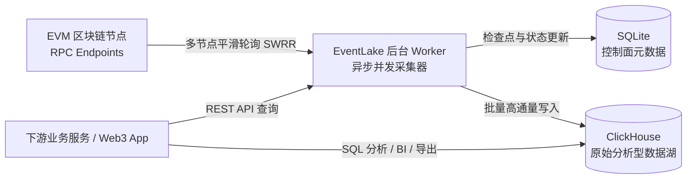

# EventLake 部署后使用指南 (Usage Guide)

EventLake 是一个面向 EVM 兼容区块链的高性能原始事件日志（Raw Event Logs）及区块交易数据采集、索引与检索系统。
系统采用 **SQLite（轻量控制面元数据） + ClickHouse（唯一高性能原始事件湖）** 的轻量高通量纯净架构。

本文档旨在指导你在**服务部署完成后，如何从 0 到 1 配置、采集链上数据，并通过 REST API 或 ClickHouse SQL 进行数据消费与应用开发**。

---

## 目录
1. [系统架构与工作流速览](#1-系统架构与工作流速览)
2. [使用 lakectl 独立命令行客户端 (推荐掌控方式)](#2-使用-lakectl-独立命令行客户端-推荐掌控方式)
3. [第一步：服务状态确认与健康检查](#3-第一步服务状态确认与健康检查)
4. [第二步：认证与安全配置 (API Key)](#4-第二步认证与安全配置-api-key)
5. [第三步：链与 RPC 节点池配置](#5-第三步链与-rpc-节点池配置)
   - 5.1 确认/新增链信息
   - 5.2 配置与管理 RPC 节点（含 SWRR 智能负载均衡）
6. [第四步：创建链上数据采集任务](#6-第四步创建链上数据采集任务)
   - 6.1 场景一：单合约事件采集 (Contract Scope)
   - 6.2 场景二：批量合约事件采集 (Batch Scope)
   - 6.3 场景三：全链全量事件采集 (All Events Scope)
   - 6.4 场景四：整链区块与交易全量同步 (Block & Transaction)
7. [第五步：监控同步进度与任务生命周期管理](#7-第五步监控同步进度与任务生命周期管理)
   - 7.1 查看事件日志采集任务状态
   - 7.2 查看整链区块同步进度
   - 7.3 暂停、恢复与删除任务
8. [第六步：数据消费与检索实操](#8-第六步数据消费与检索实操)
   - 8.1 方式 A：REST API Search DSL 检索事件日志
   - 8.2 方式 B：REST API 查询区块、交易与地址流水
   - 8.3 方式 C：直连 ClickHouse 进行高通量 SQL 复杂分析（强烈推荐）
9. [第七步：下游应用集成代码示例](#9-第七步下游应用集成代码示例)
   - 9.1 Python 调用示例 (REST DSL + ClickHouse 直连)
   - 9.2 Node.js / TypeScript 调用示例
10. [第八步：日常运维与灾备](#10-第八步日常运维与灾备)
   - 10.1 日志查看与故障排查
   - 10.2 数据热备份与灾难恢复
11. [常见问题与最佳实践 (FAQ)](#11-常见问题与最佳实践-faq)

---

## 1. 系统架构与工作流速览

在开始使用前，先了解系统的标准数据流动全景：



- **SQLite（嵌入在 Rust 进程中）**：无需外部 PostgreSQL，负责记录链列表、RPC 节点状态、任务订阅配置、区块 Checkpoint、API Key。
- **ClickHouse（唯一原始事件湖）**：承载 `raw_logs`（原始日志）、`blocks`（区块）、`transactions`（交易及回执）；采用 `ReplacingMergeTree` 引擎原生自动去重并处理链上分叉（Reorg）。

---

## 2. 使用 lakectl 独立命令行客户端 (推荐掌控方式)

系统自带独立单文件 CLI 客户端工具 [`scripts/lakectl`](file:///ssd0/git/EVMEventLake/scripts/lakectl)：
- **任意机器运行**：纯 Shell 实现，零 Python、Rust 编译依赖，无论是 macOS、Ubuntu 还是轻量云主机，下载单文件即可跑。
- **自动 SSH 穿透**：当服务器 8080 端口处于私网未向公网开放时，传入 `--ssh user@host` 即可自动建立临时安全隧道通信，保护资产安全。
- **解耦 `.env` 热启停**：无论区块同步还是日志采集，命令行随启随停，永不重启容器。

### 2.1 安装与环境准备

可直接从当前仓库运行，或拷贝至任意机器的系统 PATH 路径：

```bash
# 赋予执行权限并放入系统 PATH（任意机器均可）
chmod +x scripts/lakectl
sudo cp scripts/lakectl /usr/local/bin/lakectl

# 查看命令帮助
lakectl --help
```

### 2.2 登录模式与凭据持久化（先登录后操作）

`lakectl` 支持 3 种典型连接模式，并且支持通过 `lakectl login` 一键将连接目标与 API Key 持久化保存到 `~/.lakectl/config`，**后续在此机器上执行任何操作均无需再重复输入 `-s`、`--url` 或 `--key` 参数**：

#### 模式 A：远程公网直连（URL / 域名 / HTTPS 端口已对外暴露）
```bash
# 执行一次登录验证并保存
lakectl login --url https://eventlake.yourdomain.com --key evl_xxx

# 或直接带 IP 和端口
lakectl login --url http://47.98.xxx.xxx:8080 --key evl_xxx
```

#### 模式 B：SSH 安全穿透模式（服务器端口未向公网暴露，通过 SSH 穿透内部端口）
当服务器处于私有网络或防火墙只开放了 SSH 端口（22）时，`lakectl` 自动在底层建立临时安全转发隧道：
```bash
# 登录远程服务器并指定容器/服务内部端口 (默认 8080，可用 --remote-port 自定义)
lakectl login -s root@47.98.xxx.xxx --remote-port 8080 --key evl_xxx

# 如使用非标准 SSH 端口或专属私钥：
lakectl login -s root@47.98.xxx.xxx -p 2222 -i ~/.ssh/id_rsa --key evl_xxx
```

#### 模式 C：本地直连（服务运行在本机 Docker 或开发环境）
```bash
# 本地无需特别登录，默认直连 http://127.0.0.1:8080
lakectl status
```

#### 登录状态查看与退出：
```bash
# 查看当前生效的连接模式、目标、内部端口与连通性
lakectl whoami

# 退出登录并清除本地保存凭据
lakectl logout
```

### 2.3 交互式全屏动态监控大盘 (`lakectl top`)

类似 `htop` / `k9s`，实时高亮刷新整体概况、各链 RPC 延迟池、日志采集 Checkpoint 以及整链区块交易同步进度条（登录后直接执行，自动复用连接配置）：

```bash
# 登录后直接运行，零额外参数！
lakectl top

# 也支持即时临时覆盖参数运行：
# lakectl top -s root@47.98.xxx.xxx
```

### 2.4 常用快捷控制命令

```bash
# 查看 Lake 全局健康与统计摘要 (登录后直接免参调用)
lakectl status

# 整链区块与交易全量同步 (blocks & transactions)
lakectl block start 8453 --from 19000000 --batch 20    # 启动 Base 链同步
lakectl block status 8453                              # 查看进度
lakectl block pause 8453                               # 暂停同步
lakectl block resume 8453                              # 恢复同步 (自动断点续传)

# 事件日志采集管理 (raw_logs)
lakectl log list                                       # 列出所有订阅与 Checkpoint
lakectl log add 8453 --contract 0x833589fCD6eDb6E08f4c7C32D4f71b54bdA02913 --from 19000000
lakectl log add 8453 --all-events --from 20000000      # 启动全链全量事件采集
lakectl log pause <SUB_ID>                             # 暂停采集
lakectl log resume <SUB_ID>                            # 恢复采集

# 节点池与链检查
lakectl rpc list                                       # 查看节点状态、权重与延迟
lakectl rpc check                                      # 触发全量节点测速与健康检查
lakectl chain list                                     # 查看所有支持的链
```

### 2.5 声明式配置导入与导出 (Config Import / Export)

当你需要在一个文件中统一指定全集群的所有链、RPC 节点池、要采集的合约以及哪些链开启区块交易同步时，可以使用声明式配置（参考模板 [`config/eventlake.example.json`](file:///ssd0/git/EVMEventLake/config/eventlake.example.json)）：

```json
{
  "version": "1.0",
  "chains": [
    { "chain_id": 8453, "name": "Base", "native_token_symbol": "ETH" }
  ],
  "rpc_endpoints": [
    { "chain_id": 8453, "url": "https://mainnet.base.org", "weight": 100 },
    { "chain_id": 8453, "url": "https://base.llamarpc.com", "weight": 80 }
  ],
  "subscriptions": [
    {
      "chain_id": 8453,
      "collection_scope": "contract",
      "contract_address": "0x833589fCD6eDb6E08f4c7C32D4f71b54bdA02913",
      "start_block": 19000000,
      "realtime_enabled": true
    }
  ],
  "block_transaction_sync": [
    {
      "chain_id": 8453,
      "enabled": true,
      "start_block": 19000000,
      "batch_size": 20
    }
  ]
}
```

#### 导出与幂等导入命令：
```bash
# 1. 将当前线上集群状态全量导出为声明式 JSON 配置文件
lakectl export cluster_config.json
# 或使用完整形式：
lakectl config export cluster_config.json

# 2. 幂等导入声明式配置文件 (支持无限次重复导入)
lakectl import cluster_config.json
# 或远程穿透导入：
lakectl import cluster_config.json -s root@47.98.xxx.xxx
```

> [!TIP]
> **重复导入的非破坏性保障 (Non-destructive Upsert)**：
> - **事件日志订阅**：对于已存在的合约或全量订阅，重复导入仅确保其激活，**绝对不会重置已经同步落盘的 Checkpoint 进度**，不造成重复拉取。
> - **区块交易同步**：对于正在同步的链，重复导入仅更新策略参数，**已经前进的 `next_block` 高度绝对不会被回退**。
> - **RPC 节点池**：自动以 `(chain_id, url)` 为键进行平滑更新，已有节点更新权重并恢复可用，不产生重复垃圾数据。


---

## 3. 第一步：服务状态确认与健康检查 (REST API 方式)

无论你是通过本地 Docker Compose 还是远程自动化脚本部署，部署完成后默认对外暴露：
- **EventLake HTTP API**：默认端口 `8080`（受 `.env` 中的 `EVENTLAKE_HTTP_PORT` 控制）
- **ClickHouse HTTP 接口**：默认端口 `8123`
- **ClickHouse Native TCP 接口**：默认端口 `9000`

### 2.1 检查系统健康与就绪状态

```bash
# 1. 存活检查 (Liveness)
curl -fsS http://127.0.0.1:8080/health/live

# 响应示例：
# {"success":true,"data":{"status":"alive"},"error":null,"meta":null}

# 2. 就绪检查 (Readiness，验证数据库连接)
curl -fsS http://127.0.0.1:8080/health/ready

# 响应示例：
# {"success":true,"data":{"status":"ready"},"error":null,"meta":null}
```

### 2.2 查看全局运行大盘统计

系统提供了一键监控接口，能直观汇总当前活跃任务数、日志总量及节点健康状态：

```bash
curl -fsS http://127.0.0.1:8080/api/dashboard
```

**响应示例：**
```json
{
  "success": true,
  "data": {
    "active_jobs": 2,
    "paused_jobs": 0,
    "errored_jobs": 0,
    "total_raw_logs": 128503,
    "total_decoded_events": 0,
    "healthy_rpc_endpoints": 3,
    "unhealthy_rpc_endpoints": 0,
    "active_block_sync_jobs": 1,
    "errored_block_sync_jobs": 0
  },
  "error": null,
  "meta": null
}
```

### 2.3 导出 OpenAPI / Swagger 文档

EventLake 严格遵循 OpenAPI 规范，你可以直接导出 JSON 规范并导入 Postman 或 ApiFox：

```bash
curl -fsS http://127.0.0.1:8080/api/openapi.json > eventlake_openapi.json
```

---

## 4. 第二步：认证与安全配置 (API Key)

### 3.1 模式说明
- **开发/内网模式**：`.env` 中设置 `EVENTLAKE_REQUIRE_AUTHENTICATION=false`。此时无需传任何 Token 或 Key，所有调用自动视为 Admin。
- **生产模式**：`.env` 中设置 `EVENTLAKE_REQUIRE_AUTHENTICATION=true` 并配置强随机的 `EVENTLAKE_JWT_SECRET`。

### 3.2 生成 API Key

在生产环境下，请求接口需在 Header 中添加 `X-API-Key: evl_...`。
API Key 支持两种权限角色：
- `admin`：具有创建、暂停、修改任务及管理链/RPC 等所有写权限。
- `read_only`：仅允许检索日志、查询区块交易与查看看板。

```bash
# 生成管理员 Key（创建时明文仅返回一次，务必妥善记录！）
curl -sS -X POST http://127.0.0.1:8080/api/auth/api-keys \
  -H 'Content-Type: application/json' \
  -d '{
    "name": "production-admin-key",
    "role": "admin"
  }'
```

**响应示例：**
```json
{
  "success": true,
  "data": {
    "id": "c7a6e118-2e8b-4a57-b2e1-45da589eb4f3",
    "name": "production-admin-key",
    "role": "admin",
    "api_key": "evl_9f8d7c6b5a4e3d2c1b0a9f8e7d6c5b4a",
    "created_at": "2026-09-20T12:00:00Z"
  }
}
```

后续调用只需携带：
```bash
-H 'X-API-Key: evl_9f8d7c6b5a4e3d2c1b0a9f8e7d6c5b4a'
```

---

## 5. 第三步：链与 RPC 节点池配置

数据采集依赖健康的 EVM JSON-RPC 节点。EventLake 内置了智能 RPC 节点池，具备 **平滑加权轮询（SWRR）**、**故障阶梯式冷却（1m -> 5m -> 24h）** 与 **自动探活恢复** 能力。

### 4.1 确认/新增链信息

系统预置了主流 EVM 链：
- `1`: Ethereum (ETH)
- `8453`: Base (ETH)
- `42161`: Arbitrum One (ETH)
- `10`: OP Mainnet (ETH)
- `137`: Polygon (POL)
- `56`: BSC (BNB)

#### 查看已有链
```bash
curl -sS http://127.0.0.1:8080/api/chains
```

#### 注册自定义 EVM 链（例如 Anvil 本地测试链、Sepolia、Avalanche 等）
```bash
curl -sS -X POST http://127.0.0.1:8080/api/chains \
  -H 'Content-Type: application/json' \
  -d '{
    "chain_id": 11155111,
    "name": "Sepolia",
    "native_token_symbol": "ETH",
    "safe_confirmation_depth": 6,
    "default_min_block_window": 1,
    "default_max_block_window": 500,
    "rpc_notes": "Ethereum Sepolia Testnet"
  }'
```

### 4.2 配置与管理 RPC 节点

你可以选择两种方式注入 RPC 节点：

#### 方式 1：配置文件种子自动加载（推荐，开箱即用）
在 `config/rpc_endpoints.json` 中定义各链的 RPC 节点，服务启动时会自动读取并幂等加载（已有节点不会重复创建）：

```json
[
  {
    "chain_id": 1,
    "url": "https://eth.llamarpc.com",
    "weight": 100
  },
  {
    "chain_id": 8453,
    "url": "https://mainnet.base.org",
    "weight": 100
  },
  {
    "chain_id": 8453,
    "url": "https://base.llamarpc.com",
    "weight": 80
  }
]
```

#### 方式 2：通过 REST API 动态添加与管理
```bash
# 1. 为 Base 链 (8453) 添加一个 RPC 端点
curl -sS -X POST http://127.0.0.1:8080/api/rpc-endpoints \
  -H 'Content-Type: application/json' \
  -d '{
    "chain_id": 8453,
    "url": "https://base-rpc.publicnode.com",
    "weight": 100
  }'

# 2. 主动对某个 RPC 进行连通性测速与探活检查 (返回延迟 ms 与区块高度)
curl -sS -X POST http://127.0.0.1:8080/api/rpc-endpoints/<ENDPOINT_ID>/check

# 3. 临时禁用/启用节点
curl -sS -X POST http://127.0.0.1:8080/api/rpc-endpoints/<ENDPOINT_ID>/disable
curl -sS -X POST http://127.0.0.1:8080/api/rpc-endpoints/<ENDPOINT_ID>/enable
```

---

## 6. 第四步：创建链上数据采集任务

EventLake 提供极其灵活的数据采集维度，满足从精细合约分析到全链镜像同步的各类场景。

### 5.1 场景一：单合约事件采集 (Contract Scope)

适用于关注特定智能合约（如 Uniswap 交易对、USDC 合约、自研业务合约）：

```bash
# 采集 Base 链上 USDC 合约从区块 19000000 开始的所有事件
curl -sS -X POST http://127.0.0.1:8080/api/subscriptions \
  -H 'Content-Type: application/json' \
  -d '{
    "chain_id": 8453,
    "collection_scope": "contract",
    "contract_address": "0x833589fCD6eDb6E08f4c7C32D4f71b54bdA02913",
    "start_block": 19000000,
    "realtime_enabled": true,
    "min_block_window": 1,
    "max_block_window": 200
  }'
```

- `start_block`：起始区块高度（必填）。系统会从该高度开始抓取并自动推进 Checkpoint。
- `realtime_enabled`: 是否在追平最新高度后，持续实时监听新区块。
- `min_block_window` / `max_block_window`：单次 `eth_getLogs` 查询的区块跨度区间。系统内置智能动态伸缩机制（若单次日志量过大导致 RPC 报错，窗口会自动减半；平稳时自动扩大以提升吞吐）。

### 5.2 场景二：批量合约事件采集 (Batch Scope)

当你需要同时追踪几十甚至上百个同质合约（例如跟踪某个 DeFi 协议部署的所有流动性池）时，**批量接口会在一次 RPC 请求中通过地址数组合并查询**，极大地节省 RPC 调用配额：

```bash
curl -sS -X POST http://127.0.0.1:8080/api/subscriptions/batch \
  -H 'Content-Type: application/json' \
  -d '{
    "chain_id": 8453,
    "contract_addresses": [
      "0x833589fCD6eDb6E08f4c7C32D4f71b54bdA02913",
      "0x4200000000000000000000000000000000000006",
      "0x50c5725949A6F0c72E6C4a641F24049A917DB0Cb"
    ],
    "start_block": 19000000,
    "realtime_enabled": true
  }'
```
*注：接口会自动对地址格式进行标准化和去重，并规避重复拉取。*

### 5.3 场景三：全链全量事件采集 (All Events Scope)

构建真正意义上的“全链事件数据湖”（即采集该链上所有合约产生的所有事件）：

```bash
curl -sS -X POST http://127.0.0.1:8080/api/subscriptions \
  -H 'Content-Type: application/json' \
  -d '{
    "chain_id": 8453,
    "collection_scope": "all_events",
    "start_block": 20000000,
    "realtime_enabled": true,
    "min_block_window": 1,
    "max_block_window": 50
  }'
```
> [!IMPORTANT]
> `all_events` 模式下 `eth_getLogs` 不带合约地址过滤，单块日志量可能非常大。建议使用自建 RPC 或高质量商业 RPC，并将 `max_block_window` 设为较小值（如 10~50）。

### 5.4 场景四：整链区块与交易全量同步 (Block & Transaction)

如需同步完整的区块头、交易详情、Gas 消耗、执行状态（Success/Revert）以及 L2 燃气指标（如 L1 Fee）：

首先确保在 `.env` 中开启：
```bash
EVENTLAKE_BLOCK_TRANSACTION_ENABLED=true
```

然后通过 API 启动指定链的整链同步任务：
```bash
curl -sS -X PUT http://127.0.0.1:8080/api/chains/8453/block-transaction-sync \
  -H 'Content-Type: application/json' \
  -d '{
    "start_block": 20000000,
    "end_block": null,
    "batch_size": 20,
    "reorg_window": 32,
    "realtime_enabled": true,
    "status": "pending"
  }'
```
- `end_block`: 可选，设为 `null` 表示无限期实时追踪最新链顶。
- `batch_size`: 单次并发批量拉取的区块数量。
- `reorg_window`: 检测链分叉（Reorg）的回退窗口深度。

---

## 7. 第五步：监控同步进度与任务生命周期管理

### 6.1 查看事件日志采集任务状态

```bash
# 查询所有的订阅任务
curl -sS http://127.0.0.1:8080/api/subscriptions
```

**关键字段解读：**
```json
{
  "id": "3fa85f64-5717-4562-b3fc-2c963f66afa6",
  "chain_id": 8453,
  "collection_scope": "contract",
  "contract_address": "0x833589fcd6edb6e08f4c7c32d4f71b54bda02913",
  "start_block": 19000000,
  "current_block": 19052100,
  "target_block": null,
  "status": "realtime_syncing",
  "current_block_window": 100,
  "error_message": null
}
```
- `current_block`：当前采集完成并持久化落盘的最新区块 Checkpoint。
- `status` 状态流转：
  - `pending`：刚创建等待 Worker 认领。
  - `historical_syncing`：正在快速补全历史区块数据。
  - `realtime_syncing`：历史已追平，正在跟随链顶实时采集。
  - `paused`：已被用户手动暂停。
  - `error`：发生严重错误（如 RPC 持续不可用），可通过 `error_message` 查看原因。

### 6.2 查看整链区块同步进度

```bash
curl -sS http://127.0.0.1:8080/api/chains/8453/sync-status
```
返回中会包含：
- `next_block`：即将同步的下一个区块高度。
- `safe_head`：当前链上已确认安全的最高区块。
- `latest_seen_block`：RPC 探测到的链最新高度。

### 6.3 暂停、恢复与删除任务

```bash
# 暂停事件采集任务
curl -sS -X POST http://127.0.0.1:8080/api/subscriptions/<SUBSCRIPTION_ID>/pause

# 恢复事件采集任务（自动从暂停时的 Checkpoint 断点续传）
curl -sS -X POST http://127.0.0.1:8080/api/subscriptions/<SUBSCRIPTION_ID>/resume

# 删除任务
curl -sS -X DELETE http://127.0.0.1:8080/api/subscriptions/<SUBSCRIPTION_ID>

# 暂停 / 恢复整链区块交易同步
curl -sS -X POST http://127.0.0.1:8080/api/chains/8453/block-transaction-sync/pause
curl -sS -X POST http://127.0.0.1:8080/api/chains/8453/block-transaction-sync/resume
```

---

## 8. 第六步：数据消费与检索实操

数据落盘至 ClickHouse 后，下游应用有三种极其高效的消费方式。

### 7.1 方式 A：REST API Search DSL 检索事件日志

EventLake 提供了强大的 Search DSL，支持多字段 AND 组合检索与灵活排序，且**底层自动屏蔽 Reorg 孤儿日志**。

- **接口**：`POST /api/raw-logs/search`
- **必填过滤器**：`chain_id` 的 `eq` 操作。
- **可选过滤器字段**：`block_number`、`contract_address`、`transaction_hash`、`topic0`、`topic1`、`topic2`、`topic3`。
- **支持操作符**：`eq`（等于）、`ne`（不等于）、`gt`（大于）、`gte`（大于等于）、`lt`（小于）、`lte`（小于等于）、`in`（包含）。

#### 示例 1：查询指定合约在某个区块区间的所有 ERC-20 Transfer 事件
ERC-20 `Transfer(address,address,uint256)` 的 topic0 为：  
`0xddf252ad1be2c89b69c2b068fc378daa952ba7f163c4a11628f55a4df523b3ef`

```bash
curl -sS -X POST http://127.0.0.1:8080/api/raw-logs/search \
  -H 'Content-Type: application/json' \
  -d '{
    "page": 1,
    "limit": 20,
    "filters": [
      {"field": "chain_id", "operator": "eq", "value": 8453},
      {"field": "contract_address", "operator": "eq", "value": "0x833589fCD6eDb6E08f4c7C32D4f71b54bdA02913"},
      {"field": "topic0", "operator": "eq", "value": "0xddf252ad1be2c89b69c2b068fc378daa952ba7f163c4a11628f55a4df523b3ef"},
      {"field": "block_number", "operator": "gte", "value": 19000000},
      {"field": "block_number", "operator": "lte", "value": 19005000}
    ],
    "sort": {
      "field": "block_number",
      "direction": "desc"
    }
  }'
```

#### 示例 2：查询某笔交易包含的所有事件日志
```bash
curl -sS -X POST http://127.0.0.1:8080/api/raw-logs/search \
  -H 'Content-Type: application/json' \
  -d '{
    "filters": [
      {"field": "chain_id", "operator": "eq", "value": 8453},
      {"field": "transaction_hash", "operator": "eq", "value": "0x4b7f58987b22a013d332402ffab515fa016e4dbb38a7deebaa99a8b1d6f51f50"}
    ]
  }'
```

### 7.2 方式 B：REST API 查询区块、交易与地址流水

#### 1. 查询区块详情（支持十进制高度、16 进制高度或 32 字节 Hash）
```bash
curl -sS http://127.0.0.1:8080/api/chains/8453/blocks/20000000
curl -sS http://127.0.0.1:8080/api/chains/8453/blocks/0x1312d00
```

#### 2. 分页获取指定区块内的交易列表
```bash
curl -sS "http://127.0.0.1:8080/api/chains/8453/blocks/20000000/transactions?limit=50"
```

#### 3. 查询交易详情（包含 Receipt 执行状态与 Gas 数据）
```bash
curl -sS http://127.0.0.1:8080/api/chains/8453/transactions/0x4b7f58987b22a013d332402ffab515fa016e4dbb38a7deebaa99a8b1d6f51f50
```

#### 4. 查询特定地址的交易流水（支持 Keyset Cursor 分页与收发方向过滤）
```bash
curl -sS "http://127.0.0.1:8080/api/chains/8453/addresses/0x3304E22DDaa22bCdC5fCa2269b418046aE7b566A/transactions?direction=any&limit=20"
```
- `direction` 参数支持：`from`（仅支出）、`to`（仅接收）、`any`（全部关联）。

---

### 7.3 方式 C：直连 ClickHouse 进行高通量 SQL 复杂分析（强烈推荐）

EventLake 的底层数据全部保存在 ClickHouse 中，这为下游分析师、数据科学家和后端开发者提供了无与伦比的性能与灵活性。

#### 连接信息
- **主机 (Host)**: 部署服务器 IP（本地为 `127.0.0.1`）
- **HTTP 端口**: `8123`
- **Native TCP 端口**: `9000`
- **数据库 (Database)**: `eventlake`
- **用户名**: `eventlake`
- **密码**: `eventlake`

#### 关键表结构速览
1. `raw_logs`：
   - 字段：`chain_id`, `block_number`, `transaction_hash`, `log_index`, `contract_address`, `topic0`~`topic3`, `topics`, `data`, `is_removed`, `stored_at`。
2. `blocks`：
   - 字段：`chain_id`, `block_number`, `block_hash`, `parent_hash`, `timestamp`, `gas_used`, `transaction_count`, `is_canonical`。
3. `transactions`：
   - 字段：`chain_id`, `tx_hash`, `block_number`, `from_address`, `to_address`, `value`, `status`（1=成功, 0=失败）, `gas_used`, `l1_fee`, `is_canonical`。

> [!TIP]
> **ClickHouse 查询黄金准则**：
> 1. 表使用 `ReplacingMergeTree(stored_at)` 引擎，查询时建议加上 `FINAL` 关键字（如 `raw_logs FINAL`），以保证无论何时都读取去重后的最新记录。
> 2. 必须在 `WHERE` 条件中过滤无效分叉数据：
>    - 日志表：`is_removed = false`
>    - 区块与交易表：`is_canonical = true`
> 3. 必须包含分区键 `chain_id = ...`，以触发 ClickHouse 分区裁剪（Partition Pruning），实现毫秒级响应。

#### SQL 实操范例

##### 范例 1：统计过去 24 小时活跃度最高的前 10 个智能合约
```sql
SELECT 
    contract_address, 
    count() AS event_count 
FROM eventlake.raw_logs FINAL
WHERE chain_id = 8453 
  AND is_removed = false 
  AND stored_at >= now() - INTERVAL 24 HOUR
GROUP BY contract_address 
ORDER BY event_count DESC 
LIMIT 10;
```

##### 范例 2：秒级统计某合约每日产生的事件增长趋势
```sql
SELECT 
    toStartOfDay(stored_at) AS day,
    count() AS daily_events
FROM eventlake.raw_logs FINAL
WHERE chain_id = 8453
  AND contract_address = '0x833589fcd6edb6e08f4c7c32d4f71b54bda02913'
  AND is_removed = false
GROUP BY day
ORDER BY day ASC;
```

##### 范例 3：通过 ClickHouse HTTP 接口执行查询（cURL / 脚本）
```bash
curl -sS "http://127.0.0.1:8123/?user=eventlake&password=eventlake&database=eventlake" \
  --data-binary "SELECT count() FROM raw_logs FINAL WHERE chain_id = 8453 AND is_removed = false FORMAT JSONEachRow"
```

---

## 9. 第七步：下游应用集成代码示例

### 8.1 Python 消费示例

可以使用 `requests` 调用 REST API，或使用官方推荐的 `clickhouse-connect` 直连读取为 Pandas DataFrame。

```python
import requests
import clickhouse_connect

# -------------------------------------------------------------
# 方式 1: 调用 EventLake REST API 查询 Transfer 事件
# -------------------------------------------------------------
def search_events_via_api():
    url = "http://127.0.0.1:8080/api/raw-logs/search"
    payload = {
        "page": 1,
        "limit": 10,
        "filters": [
            {"field": "chain_id", "operator": "eq", "value": 8453},
            {"field": "contract_address", "operator": "eq", "value": "0x833589fCD6eDb6E08f4c7C32D4f71b54bdA02913"},
            {"field": "topic0", "operator": "eq", "value": "0xddf252ad1be2c89b69c2b068fc378daa952ba7f163c4a11628f55a4df523b3ef"}
        ],
        "sort": {"field": "block_number", "direction": "desc"}
    }
    resp = requests.post(url, json=payload).json()
    for log in resp.get("data", {}).get("items", []):
        print(f"Block: {log['block_number']}, Tx: {log['transaction_hash']}, LogIdx: {log['log_index']}")

# -------------------------------------------------------------
# 方式 2: 直连 ClickHouse 获取 DataFrame 进行数据分析
# -------------------------------------------------------------
def query_clickhouse_dataframe():
    client = clickhouse_connect.get_client(
        host='127.0.0.1', 
        port=8123, 
        username='eventlake', 
        password='eventlake', 
        database='eventlake'
    )
    df = client.query_df("""
        SELECT 
            block_number, 
            transaction_hash, 
            contract_address, 
            topic0,
            stored_at
        FROM raw_logs FINAL
        WHERE chain_id = 8453 
          AND is_removed = false
        ORDER BY block_number DESC
        LIMIT 100
    """)
    print(df.head())

if __name__ == "__main__":
    search_events_via_api()
    query_clickhouse_dataframe()
```

### 8.2 Node.js / TypeScript 消费示例

```typescript
import axios from 'axios';
import { createClient } from '@clickhouse/client';

const API_BASE = 'http://127.0.0.1:8080';

// 1. 通过 REST API 查询
async function fetchLogs() {
  const response = await axios.post(`${API_BASE}/api/raw-logs/search`, {
    page: 1,
    limit: 10,
    filters: [
      { field: 'chain_id', operator: 'eq', value: 8453 },
      { field: 'block_number', operator: 'gte', value: 19000000 }
    ],
    sort: { field: 'block_number', direction: 'desc' }
  });

  console.log('API Total Results:', response.data.data.total);
}

// 2. 直连 ClickHouse 查询
async function fetchClickHouse() {
  const client = createClient({
    url: 'http://127.0.0.1:8123',
    username: 'eventlake',
    password: 'eventlake',
    database: 'eventlake'
  });

  const resultSet = await client.query({
    query: `
      SELECT count() as total_count 
      FROM raw_logs FINAL 
      WHERE chain_id = 8453 AND is_removed = false
    `,
    format: 'JSONEachRow'
  });

  const rows = await resultSet.json();
  console.log('ClickHouse Count Result:', rows);
  await client.close();
}

async function main() {
  await fetchLogs();
  await fetchClickHouse();
}

main().catch(console.error);
```

---

## 10. 第八步：日常运维与灾备

### 10.1 日志查看与故障排查

部署目录运行以下命令实时追踪服务状态：

```bash
# 查看主采集服务日志
docker compose logs -f eventlake

# 查看 ClickHouse 数据库日志
docker compose logs -f clickhouse

# 过滤特定错误日志
docker compose logs eventlake | grep "ERROR"
```

### 10.2 数据热备份与灾难恢复

EventLake 提供了开箱即用的原子备份与增量恢复脚本（同时备份 SQLite 数据库文件与 ClickHouse 表分片快照）：

```bash
# 1. 触发一次全量热备份 (存入 ./backups/ 目录或云端 S3)
./scripts/backup.sh

# 备份生成清单示例：
# backups/eventlake_backup_20260920_120000/
# ├── manifest.json
# ├── sqlite/eventlake.db.snapshot
# └── clickhouse/raw_logs/ ...

# 2. 灾难恢复（指定备份包目录）
./scripts/restore.sh backups/eventlake_backup_20260920_120000
```
更深入的云端 S3/MinIO/Cloudflare R2 自动化备份配置，请参阅 [`docs/BACKUP_AND_RESTORE.md`](BACKUP_AND_RESTORE.md)。

---

## 11. 常见问题与最佳实践 (FAQ)

### Q1: 启动后任务一直显示 `pending`，没有采集数据？
- **检查项 1**：查看 `GET /api/chains/{id}` 中对应的链是否有可用的 RPC 端点。如果是刚部署的新链，需先调用 `POST /api/rpc-endpoints` 添加至少一个可用节点。
- **检查项 2**：调用 `POST /api/rpc-endpoints/{id}/check` 测试该 RPC 是否能正常返回高度。某些公共节点存在跨域或限流。
- **检查项 3**：检查 `.env` 中的 `EVENTLAKE_BACKGROUND_WORKERS_ENABLED` 是否为 `true`。

### Q2: 为什么有些公共 RPC 总是频繁报错或进入 Cooldown 冷却？
- 许多免费的公开 RPC（如 Cloudflare 或公共节点）对 `eth_getLogs` 的单次请求区块跨度或返回数据量有严格限制（如最多 1000 块或 2000 条 Log）。
- **优化方案**：
  1. 创建订阅时适当调小 `max_block_window`（例如设为 `50` 或 `100`）。
  2. 多配置 2~3 个备用 RPC 节点，系统内置的 SWRR 算法会自动在节点间平滑调度并在节点受限时无缝切换。

### Q3: 采集到的数据下游怎么做 ABI 解码？
- **EventLake 架构准则**：系统坚持 **Raw Event Lake 优先** 原则，专注于确保全量原始日志（`topics` 和十六进制 `data`）毫秒级入库与不丢不漏，不内置固化易变的业务 ABI。
- **下游解码实践**：
  - 下游在消费数据时，使用对应语言的成熟 Web3 库即可在内存中毫秒级完成解码：
    - **TypeScript / Node.js**：使用 `ethers.js` 或 `viem` 的 `decodeEventLog({ abi, data, topics })`。
    - **Python**：使用 `web3.py` 的 `contract.events.<EventName>().process_receipt()` 或 `eth_abi.decode()`。
    - **Go**：使用 `go-ethereum/accounts/abi`。

### Q4: 如何在多台机器或团队之间共享？
- EventLake 支持使用 [`scripts/deploy-remote.sh`](../scripts/deploy-remote.sh) 一键部署到远程 Linux 云服务器，通过标准的 REST API 与 ClickHouse 端口供整个团队或集群共享调用。
